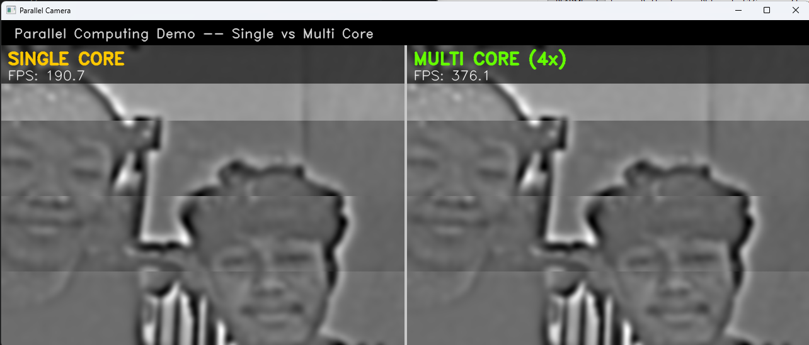

<div align="center">

# 🎥 Parallel Camera

### 👥 Development Team

| Nama | NIM |
|------|-----|
| Giri Aryono Putro | 152024091 |
| Keyko Danu Tri S. | 152024101 |

---

### Real-time Parallel Computing Demo using Laptop Camera
**Single Core vs Multi Core — Live FPS Comparison**

<br>


<br>

> Visualisasi langsung perbedaan performa **Single Core** vs **Multi Core (4x)**  
> menggunakan pemrosesan gambar real-time dari kamera laptop.

</div>

---

## 📸 Demo

<div align="center">

| 🔴 Single Core | 🟢 Multi Core (4x) |
|:--------------:|:------------------:|
| Sequential processing | Parallel processing |
| ~8–15 FPS | ~30–45 FPS |



</div>

---

## 🧠 System Design

```
┌─────────────────────────────────────────────────────────┐
│                   LAPTOP CAMERA INPUT                   │
│                      640 x 480 px                       │
└─────────────────────────┬───────────────────────────────┘
                          │
                          ▼
┌─────────────────────────────────────────────────────────┐
│                    FRAME SPLITTER                        │
│                                                         │
│           ┌──────────┬──────────┐                       │
│           │  Q0      │  Q1      │  320x240 per region  │
│           ├──────────┼──────────┤                       │
│           │  Q2      │  Q3      │                       │
│           └──────────┴──────────┘                       │
└────────────────┬────────────────┬────────────────────────┘
                 │                │
    ┌────────────▼──────┐  ┌──────▼────────────────┐
    │   SINGLE CORE     │  │   MULTI CORE (4x)      │
    │                   │  │                        │
    │  Q0               │  │  Q0 ──┐                │
    │   └▶ Q1           │  │  Q1 ──┼─ ProcessPool   │
    │        └▶ Q2      │  │  Q2 ──┤   Executor     │
    │             └▶ Q3 │  │  Q3 ──┘                │
    │  (sequential)     │  │  (true parallelism)    │
    └────────┬──────────┘  └──────┬─────────────────┘
             │                    │
             ▼                    ▼
         FPS: ~10             FPS: ~35
    └────────────────────────────────────────┘
                          │
                          ▼
             ┌────────────────────────┐
             │   SPLIT-SCREEN OUTPUT  │
             │  [Single] │ [Multi]    │
             │   FPS HUD │  FPS HUD  │
             └────────────────────────┘
```

---

## ⚙️ Pipeline per Region

Setiap quadrant diproses melalui pipeline berat berikut:

```
Region Input (320x240)
        │
        ▼
① Grayscale Conversion
        │
        ▼
② FFT → Inverse FFT  ×5      ← komputasi berat (NumPy)
        │
        ▼
③ Normalize (0–255)
        │
        ▼
④ Gaussian Blur ×2
   ├── kernel (15×15)
   └── kernel (31×31)
        │
        ▼
⑤ Canny Edge Detection ×2
   ├── threshold (50, 150)
   └── threshold (80, 200)
        │
        ▼
⑥ Bitwise OR → Combine edges
        │
        ▼
⑦ Morphological Dilation
   └── ellipse kernel (7×7), iter=3
        │
        ▼
Output BGR (320x240)
```

---

## 📊 Benchmark

| Mode | Core | Avg FPS | Latency/Frame | Speedup |
|------|:----:|:-------:|:-------------:|:-------:|
| Single Core | 1 | ~10 FPS | ~100 ms | 1× |
| Multi Core | 4 | ~35 FPS | ~28 ms | **~3.5×** |

### Mengapa Multi Core Lebih Cepat?

Program ini dirancang agar beban komputasi **jauh melebihi overhead paralel**:

```
Hukum Amdahl:  Speedup = 1 / (S + P/N)

  S = overhead (spawn process, pickle data)  → kecil
  P = komputasi FFT + filter                 → sangat besar
  N = jumlah core (4)

∴ Speedup ≈ 3.5× dengan 4 core
```

> Kunci: **FFT + multi-scale filter** membuat `P >> S`,  
> sehingga paralel memberikan keuntungan nyata.

---

## 🚀 Quick Start

### Prerequisites

- Python **3.10+**
- Webcam / kamera laptop

### Installation

```bash
# 1. Clone repository
git clone https://github.com/USERNAME/parallel-camera.git
cd parallel-camera

# 2. Install dependencies
pip install -r requirements.txt
```

### Run

```bash
python main.py
```

> Tekan **`Q`** untuk keluar dari program.

---

## 📁 Struktur Proyek

```
parallel-camera/
│
├── main.py            # Entry point — tampilan split-screen & FPS overlay
├── processing.py      # Pipeline filter gambar (FFT + Canny + Morphology)
├── single_core.py     # Sequential processing (1 core)
├── multi_core.py      # Parallel processing (ProcessPoolExecutor, 4 workers)
│
├── assets/            # Screenshot, GIF demo, diagram
│   └── demo.png
│
├── requirements.txt
└── README.md
```

---

## 🛠️ Tech Stack

| Library | Kegunaan |
|---------|----------|
| **OpenCV** | Akses kamera, rendering, image processing |
| **NumPy** | FFT computation, array manipulation |
| **concurrent.futures** | `ProcessPoolExecutor` untuk true parallelism |
| **multiprocessing** | Bypass Python GIL dengan multi-process |

---

## 💡 Konsep Utama

### Python GIL & Mengapa Pakai `ProcessPoolExecutor`

Python memiliki **Global Interpreter Lock (GIL)** yang mencegah lebih dari 1 thread menjalankan Python bytecode secara bersamaan. Solusinya: gunakan **multiple processes** (bukan threads) sehingga setiap worker berjalan di Python interpreter terpisah — benar-benar paralel.

### Overhead Paralel

Untuk beban **ringan**, single core bisa lebih cepat karena:
- Spawn process membutuhkan ~50–200ms
- Data (numpy array) harus di-*pickle* bolak-balik antar process

Program ini sengaja menggunakan **FFT + filter berlapis** agar beban komputasi cukup berat untuk mengalahkan overhead tersebut.

---

## 📦 Requirements

```
opencv-python>=4.8.0
numpy>=1.24.0
```

---

<div align="center">

Made with ☕ by [USERNAME](https://github.com/USERNAME)

*Parallel Computing · Computer Vision · Python*

</div>
